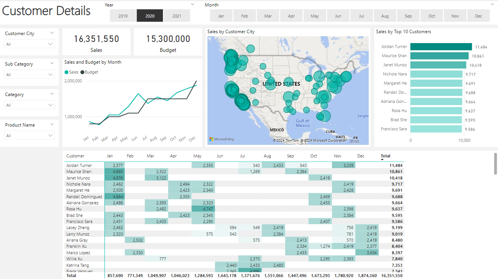
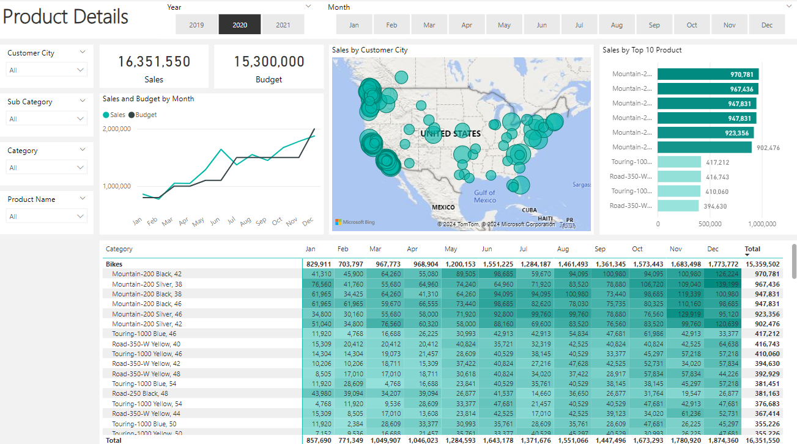

# Introduction
This project set out to explore the AdventureWorks dataset from Microsoft SQL Server. The dataset contains sales data for a fictitious company. The goal was to explore the data and create a PowerBI report to answer questions about the company.

SQL queries and Power BI files are included in the repository.

# Background
This project was driven by a desire to showcase my SQL and Power BI skills and build up my data analysis portfolio.

The following table shows the User Stories for the project.

| No # | As a (role)          | I want (request / demand)                           | So that I (user value)                                 | Acceptance Criteria                                          |
|------|----------------------|-----------------------------------------------------|--------------------------------------------------------|--------------------------------------------------------------|
| 1    | Sales Manager        | To get a dashboard overview of internet sales       | Can follow better which customers and products sells the best | A Power BI dashboard which updates data once a day           |
| 2    | Sales Representative | A detailed overview of Internet Sales per Customers | Can follow up my customers that buys the most and who we can sell ore to | A Power BI dashboard which allows me to filter data for each customer |
| 3    | Sales Representative | A detailed overview of Internet Sales per Products  | Can follow up my Products that sells the most          | A Power BI dashboard which allows me to filter data for each Product  |
| 4    | Sales Manager        | A dashboard overview of internet sales              | Follow sales over time against budget                  | A Power Bi dashboard with graphs and KPIs comparing against budget.   |

# Tools I Used
For my project I utilized the following tools:
- **Microsoft SQL Server:**  Database management system.
- **SQL:** Language used to query the database and export the data for Power BI.
- **Visual Studio Code:** My preferred code editor for SQL queries.
- **Power BI:** Data visualization tool.
-**Git & GitHub:** Version control system and repository.

# SQL Queries
The following SQL queries were used to extract the data from the database.
```sql
-- Cleansed Dim_Date Table --
USE
    AdventureWorksDW2022
SELECT
    DateKey
    ,FullDateAlternateKey AS Date
    ,EnglishDayNameOfWeek AS Day
    ,EnglishMonthName AS Month
    ,LEFT(EnglishMonthName, 3) AS MonthShort  --Useful for front end date navigation and front end graphs.
    ,MonthNumberOfYear AS MonthNo
    ,CalendarQuarter AS Quarter
    ,CalendarYear AS Year 
FROM
    [dbo].[dimdate] 
WHERE
    CalendarYear >= 2019
```

```sql
-- Cleansed Dim_Customer's Table --
USE
    AdventureWorksDW2022
SELECT
    c.[CustomerKey] AS CustomerKey
      ,c.[FirstName] AS 'First Name'
      ,c.[LastName] AS 'Last Name'
      ,c.FirstName + ' ' + c.LastName AS 'Full Name'
      ,CASE c.[Gender] WHEN 'M' THEN 'Male' WHEN 'F' THEN 'Female' END AS Gender
      ,c.[DateFirstPurchase] AS 'Date First Purchase'
      ,g.City AS 'Customer City' -- Joined in Customer City form Geography Table
FROM
    [AdventureWorksDW2022].[dbo].[DimCustomer] AS c
    LEFT JOIN dbo.DimGeography AS g ON g.GeographyKey = c.GeographyKey
ORDER BY
    CustomerKey ASC  -- Ordered List by Customer Key
```

```sql
-- Cleansed Dim_Products Table --
USE
    AdventureWorksDW2022
SELECT 
    p.[ProductKey]
    ,p.[ProductAlternateKey] AS ProductItemCode
    ,p.[EnglishProductName] AS 'Product Name'
    ,ps.EnglishProductSubcategoryName AS 'Sub Category'  -- Joined in from Sub Category Table
    ,pc.EnglishProductCategoryName AS 'Product Category'  -- Joined in from Category Table
    ,p.[Color] AS 'Product Color'
    ,p.[Size] AS 'Product Size'
    ,p.[ProductLine] AS 'Product Line'
    ,p.[ModelName] AS 'Product Model Name'
    ,p.[EnglishDescription] AS 'Product Description'
    ,ISNULL(p.[Status], 'Outdated') AS 'Product Status'
  FROM
        [dbo].[DimProduct] AS p
        LEFT JOIN dbo.DimProductSubcategory AS ps ON ps.ProductCategoryKey = p.ProductSubcategoryKey
        LEFT JOIN dbo.DimProductCategory AS pc ON ps.ProductCategoryKey = pc.ProductCategoryKey
ORDER BY
    p.ProductKey ASC
```

```sql
-- Cleansed Fact_InternetSales Table --
USE
    AdventureWorksDW2022
SELECT
    [ProductKey]
    ,CONVERT(date, CONVERT(varchar(8), [OrderDateKey], 101)) AS [OrderDateKey]
    ,CONVERT(date, CONVERT(varchar(8), [DueDateKey], 101)) AS [DueDateKey]
    ,CONVERT(date, convert(varchar(8), [ShipDateKey], 101)) AS [ShipDateKey]
    ,[CustomerKey]
    ,[SalesOrderNumber]
    ,[SalesAmount]
FROM
    [dbo].[FactInternetSales]
WHERE
    LEFT(OrderDateKey, 4) >= YEAR(GETDATE()) -2
-- Ensures we always bring only two years of dates from the extraction.
ORDER BY
    OrderDateKey ASC
```


# The Results
The following Power BI dashboards were created:

### Sales Overview


### Customer Details


### Product Details


# Conclusion
This project was a great learning experience. I learned a lot about SQL and Power BI. I am looking forward to learning more about these tools and using them in my future projects.
